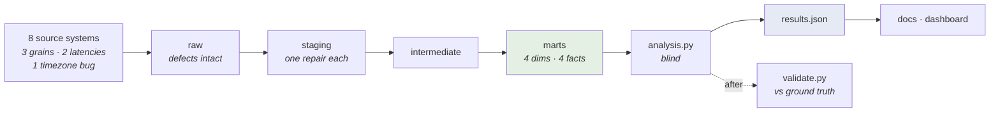

# Beyond Fill Rate

**A quick-commerce analytics warehouse built to answer one question Operations
could not.**

> *"Why is retention falling when our fill rate has stayed above 95%?"*

They were right. Fill rate never dropped below 95%. They were reading a true
number that could not answer their question.

---

## The finding, in two rows

| | |
|---|---|
| **Item fill rate** — the number on the ops dashboard | **94.09%** |
| **Order fill rate** — the number the customer experiences | **66.85%** |

Same 1,054,890 items. Same 135,996 orders. **A 27.2 point gap**, and both
numbers are correct.

An order is clean only if *every* item is, so `P(clean) = (1 − p)^basket_size`.
At a 5.9% item miss rate and a 7.8-item mean basket, roughly a
third of orders are broken by construction.

**The inversion is the decision:**

| Basket size | Item fill | Order fill |
|---|---|---|
| 1-3 | 93.78% | **85.85%** |
| 4-6 | 93.74% | **73.27%** |
| 7-10 | 94.06% | **62.75%** |
| 11-15 | 94.70% | **52.69%** |
| 16+ | 95.09% | **43.56%** |

Item fill rate says large baskets are served **slightly better**. Order fill rate
says **twice as badly**. Large baskets are the highest-value segment. *The metric
Operations optimises conceals that its best customers get its worst experience.*

---

## Architecture



**45 dbt tests. 8 planted defects. All green.** `./run_all.sh` rebuilds
everything from nothing in ~90 seconds — DuckDB stands in for BigQuery, so no
cloud account and no bill.

---

## The three results

**1. A stock-out costs 2.8× more on a new customer.**
New: **-8.10 pp** on 30-day repeat. Established: **-2.91 pp**. The pooled
-7.04 pp averages two populations needing opposite decisions.

**2. "Was the substitution good?" is unanswerable — and that's fine.**
Nothing logs it. Three defensible proxies **disagree by 4.6 pp**, so the
magnitude is not reportable. But the *ranking* is stable across proxies with
opposite selection problems — and ranking is what pickers actually need.
The worst swap is statistically indistinguishable from offering nothing.

**3. An experiment that looked harmless was destroying the funnel.**
SRM at checkout: **p = 3.3e-153**. Retention among converters: -0.39 pp,
p = 0.299 — *"no effect, ship it."* Actual conversion impact:
**-8.34 pp — 18.9% of treatment conversions destroyed.**
Not a fake win. A fake *harmless*. **Nobody re-examines a null.**

---

## Where to go next

**Start here → [`docs/09_memo.md`](docs/09_memo.md)** — the one-page answer, with the
cost assumptions stated and a "what changes my mind" section.

| If you want | Read |
|---|---|
| **The one-page decision memo** | [`docs/09_memo.md`](docs/09_memo.md) |
| The domain: why stock-outs are structural | [`docs/01_problem.md`](docs/01_problem.md) |
| The reasoning, and where I was wrong | [`docs/02_plan.md`](docs/02_plan.md) |
| **Judgement under ambiguity** | [`docs/08_ambiguity.md`](docs/08_ambiguity.md) |
| The experiment that lied | [`docs/06_experimentation.md`](docs/06_experimentation.md) |
| Warehouse design & lineage | [`docs/03_data_model.md`](docs/03_data_model.md) |
| Metric definitions (a contract, not a dashboard) | [`docs/05_metrics.md`](docs/05_metrics.md) |
| **What this does not establish** | [`docs/07_limitations.md`](docs/07_limitations.md) |

**Interactive:** [`reports/dashboard.html`](reports/dashboard.html) — the argument in six
panels, each stating what it shows *and what it hides*.
[`reports/simulator.html`](reports/simulator.html) — drag the basket size and watch a 95%
operation break half its best customers' orders. Panel 3 inverts it: to hit 90% order fill
on a 16-item basket, item fill must reach **99.34%**. That is not an ambitious target; it
is arithmetic nobody checked.

---

## Run it

```bash
pip install -r requirements.txt
./run_all.sh
```

```
1/7  generate synthetic source systems
2/7  land into warehouse raw schema
3/7  build + test the warehouse (dbt)     -> PASS=45  ERROR=0
4/7  analyse (blind to answer key)
5/7  score against ground truth           -> VALIDATION: PASS
6/7  render docs from results
7/7  verify docs match results
```

---

## Three things worth knowing before you read the code

**The data is synthetic, and that is the biggest limitation.** The numbers above
are properties of `src/generate_data.py`, not measurements of any real operator.
The *mechanisms* transfer; the *magnitudes* do not. Please do not quote
66.85% anywhere. → [`docs/07_limitations.md`](docs/07_limitations.md)

**The analysis is blind by construction.** `config.py` holds the injected truth.
`analysis.py` raises if it can reach those parameters and strips `src/` from
`sys.path`. `validate.py` is the only file allowed to open the answer key, and it
runs *after* results are committed to disk. Estimate first, grade second — no
tune-until-it-matches loop. Failing validation proves the code is wrong; passing
does not prove it right.

**The mistakes are in the code, on purpose.** A bot detector with precision
0.041. A generator bug that deleted every cancellation. A dead constant. A
doc-drift checker that passed on stale docs twice — the project's own
item-fill-rate error, one layer up, in my own tooling. They are documented where
they happened rather than quietly fixed, because the correction is the part worth
reading.

---

<sub>Synthetic data. Built by [Akanksha Swarnim](https://linkedin.com/in/akanksha-swarnim).
Python · dbt · DuckDB · SQL.</sub>
