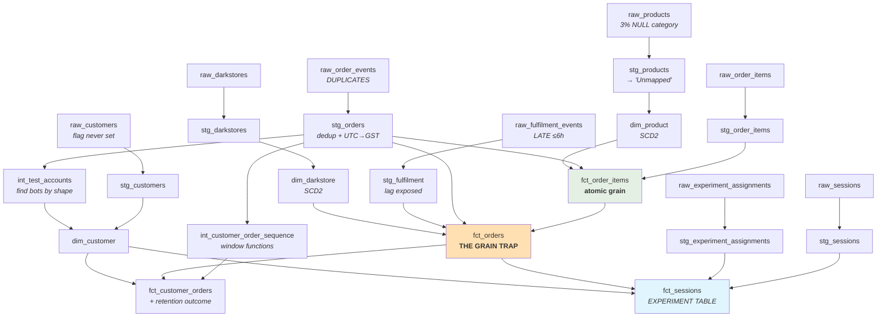

# The data model

*Why the warehouse is shaped the way it is, and what each shape costs.*

---

## Architecture

```mermaid
flowchart LR
    subgraph SRC["Source systems (8)"]
        A1["Order service<br/><i>events, UTC, retries</i>"]
        A2["Order service<br/><i>line items</i>"]
        A3["Warehouse ops<br/><i>fulfilment, ≤6h late</i>"]
        A4["App analytics<br/><i>sessions, UTC</i>"]
        A5["Catalogue<br/><i>SCD2 on price</i>"]
        A6["Ops master data<br/><i>SCD2 on catchment</i>"]
        A7["CRM<br/><i>customers</i>"]
        A8["Experiment platform<br/><i>assignments</i>"]
    end

    SRC -->|"load_raw.py<br/><i>(stands in for Fivetran/CDC)</i>"| RAW

    subgraph WH["Warehouse — DuckDB (BigQuery in production)"]
        RAW["<b>raw</b><br/>faithful copy, defects intact"]
        STG["<b>staging</b> — views<br/>cast · rename · repair one defect each"]
        INT["<b>intermediate</b> — views<br/>sequencing · bot detection"]
        MART["<b>marts</b> — tables<br/>4 dims · 4 facts"]
        RAW --> STG --> INT --> MART
    end

    MART --> AN["analysis.py<br/><i>blind to answer key</i>"]
    AN --> RES["reports/results.json"]
    RES --> DOC["render_docs.py → docs/"]
    RES --> DASH["dashboard · simulator"]
    AN -.->|after results committed| VAL["validate.py<br/><i>scores vs ground truth</i>"]

    style RAW fill:#f9e5e5
    style MART fill:#e5f0e5
    style RES fill:#e5eaf5
```



The dotted line matters: `validate.py` runs **after** `analysis.py` has written
its numbers to disk. Estimate first, grade second. Collapsing those two into one
file is how synthetic demonstrations quietly become tautologies.

---

## Lineage



Read the two highlighted nodes together. `fct_order_items` is the **atomic
grain** — one row per order-item — and `fct_orders` rolls it up. The entire
finding of this project lives in the difference between them. Had the warehouse
been modelled at order grain "to save space", the finding would be
unrecoverable, because you can always aggregate up and never disaggregate down.

---

## Source ownership

A warehouse without named owners is a warehouse where every data-quality
question dies in a Slack channel. Encoded in `dbt/models/staging/_sources.yml`
as metadata, so it travels with the code rather than living in a wiki nobody
updates.

| Source | Business owner | Grain | Clock | Latency | Known defect |
|---|---|---|---|---|---|
| `raw_order_events` | Commerce | one row per **event** | UTC | real-time | duplicate retries (~1.2%) |
| `raw_order_items` | Commerce | order × product | — | real-time | — |
| `raw_fulfilment_events` | Warehouse Ops | one row per order | UTC | **up to 6h** | late-arriving (~8%) |
| `raw_sessions` | Product | one row per session | UTC | real-time | — |
| `raw_products` | Catalogue | product × version | — | daily | ~3% NULL category |
| `raw_darkstores` | Operations | store × version | — | ad hoc | — |
| `raw_customers` | Marketing / CRM | one row per customer | — | daily | `is_test_account` never populated |
| `raw_experiment_assignments` | Experimentation | one row per session | UTC | real-time | assignment ≠ exposure |

Note the grain column on `raw_order_events`: **one row per event, not per
order**. That single distinction is the difference between a correct order count
and one that is 1.2% high — small enough never to look wrong, large enough to
move a target.

---

## The layers, and what each is forbidden from doing

| Layer | Job | Forbidden |
|---|---|---|
| `raw` | faithful copy of what the source sent | any cleaning |
| `staging` | cast, rename, repair **one** defect | joining, judgement |
| `intermediate` | joins and sequencing >1 mart needs | being queried directly |
| `marts` | the star schema the business reads | ad-hoc business rules |

`raw` is deliberately dumb. A pipeline that cleans during ingestion is a pipeline
where nobody can answer *"what did the source actually say?"* — and that question
is the first one asked in every incident.

`staging` stays 1:1 with the source on principle. The moment staging starts
making judgements, the boundary between "what we received" and "what we decided"
disappears, and it never comes back.

---

## Design decisions worth defending

### SCD Type 2 on product and darkstore. Type 1 on customer.

SCD2 is a **cost**, not a virtue: it doubles rows, forces surrogate keys, and
makes every join carry a date-range predicate. Pay it only where history
actually changes.

- **Product** — prices change. Joining January's order to today's price restates
  January's GMV. Silent: no error, no null, just numbers that stop matching last
  month's deck.
- **Darkstore** — catchment radius changes as rider supply changes. Type 1 makes
  every historical order inherit today's catchment and restates delivery-time
  history.
- **Customer** — segment and home store never change in this window. There is no
  history to lose, so Type 2 would double the table and buy nothing.

### The range join is the whole point

```sql
left join dim_product p
    on i.product_id = p.product_id
    and o.order_date_gst >= p.valid_from
    and o.order_date_gst <  p.valid_to     -- half-open, deliberately
```

Drop those last two lines and every repriced SKU fans out to two rows, doubling
its revenue. Half-open (`>=` / `<`) rather than `BETWEEN` avoids the classic
off-by-one where `valid_to` on v1 equals `valid_from` on v2 and both match.

Both failure modes have tests: `assert_scd2_no_overlapping_versions` (fan-out)
and `assert_scd2_range_join_finds_a_version` (gaps). Teams usually write neither.

### Why `dim_date` exists when every database has date functions

1. **It makes absence visible.** A `GROUP BY` on a fact table cannot show you a
   day with no orders. A join to a spine can. Silent gaps are how outages get
   found a quarter late.
2. **The business calendar lives once.** The UAE working week changed to Mon–Fri
   in 2022 — any code written against the old Fri/Sat weekend is wrong for this
   window. That belongs in one table, not in forty `WHERE` clauses.

### `store_age_days` is a fact, not a dimension

It depends on the **order date**, not the dimension row. Putting a date-relative
measure in a dimension builds a column that is only correct on the day you built
it.

---

## What would change on BigQuery

DuckDB stands in so the project runs on a laptop with no cloud account and no
bill. The SQL is held to the dialect overlap — CTEs, window functions, `QUALIFY`,
standard casts — all of which behave identically on both.

What would genuinely differ, stated rather than faked:

| | DuckDB (here) | BigQuery (production) |
|---|---|---|
| `fct_orders` | single table | **partition** on `order_date_gst`, **cluster** on `darkstore_key` |
| `fct_order_items` | single table | partition on `order_date_gst` — 1.1M rows here, ~billions real |
| Cost model | none | slots scanned; partition pruning is the difference between AED 2 and AED 2,000 a query |
| Staging | views | still views — but `fct_order_items` would be **incremental**, not full-refresh |
| Late-arriving data | rebuild | `insert_overwrite` on the affected partitions only |

The last row is the one that matters operationally. With ~8% of fulfilment rows
arriving up to 6h late, a full refresh is honest but wasteful, and an append-only
incremental is cheap but wrong. `insert_overwrite` on a lookback window of the
last two days is the standard answer, and it is a decision about **latency
tolerance**, not about SQL.
